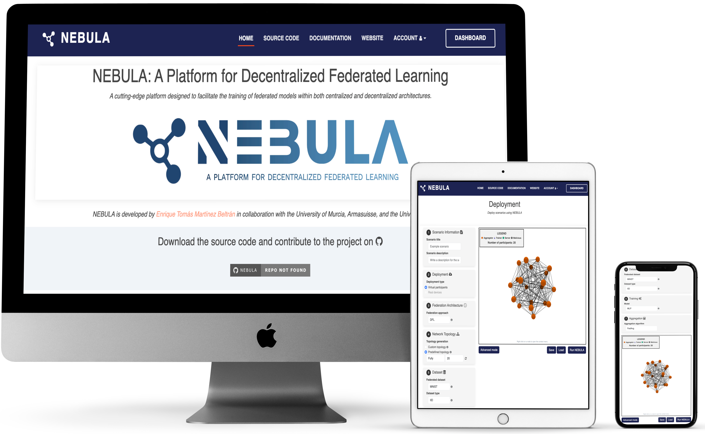
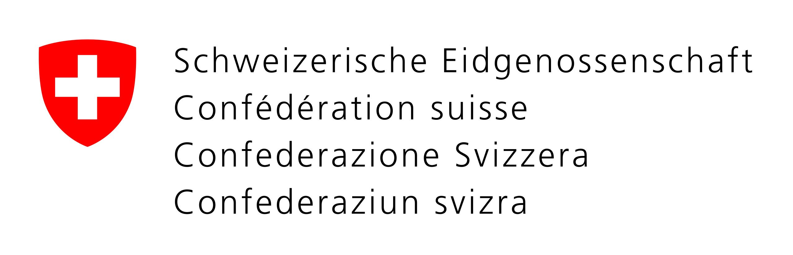

<br>
<p align="center">
  <a href="https://github.com/enriquetomasmb/fedstellar">
    
  </a>
  <h3 align="center">NEBULA: A Platform for Decentralized Federated Learning</h3>

  <p align="center">
    <a href="https://federeratedlearning.inf.um.es">federatedlearning.inf.um.es</a> / <a href="https://fedstellar.dev">fedstellar.dev</a> / <a href="https://fedstellar.eu">fedstellar.eu</a> / <a href="https://fedstellar.com">fedstellar.com</a>
  </p>
</p>

# 🌌 About NEBULA

[](https://nebula.enriquetomasmb.com)

[](https://github.com/enriquetomasmb/nebula/issues)

**NEBULA** (previously known as Fedstellar[^1]) is a cutting-edge platform designed to facilitate the training of federated models within both centralized and decentralized architectures. It streamlines the development, deployment, and management of federated applications across physical and virtualized devices.

## 🚀 Key Components

NEBULA boasts a **modular architecture** that consists of three core elements:

- **Frontend**: A user-friendly interface for setting up experiments and monitoring progress.
- **Controller**: An orchestrator that ensures efficient operation management.
- **Core**: The fundamental component deployed on each device to handle federated learning processes.

## 🌟 Main Features

- **Decentralized**: Train models without a central server, leveraging decentralized federated learning.
- **Privacy-preserving**: Maintain data privacy by training on-device and only sharing model updates.
- **Topology-agnostic**: Support for various network topologies including star, ring, and mesh.
- **Model-agnostic**: Compatible with a wide range of machine learning algorithms, from deep learning to traditional methods.
- **Network communication**: Secure and efficient device communication with features like compression, network failure tolerance, and condition simulation.
- **Trustworthiness**: Ensure the integrity of the learning process by verifying the reliability of the federation.
- **Blockchain integration**: Support for blockchain technologies to enhance security and transparency.
- **Security**: Implement security mechanisms to protect the learning process from adversarial attacks.
- **Real-time monitoring**: Provides live performance metrics and visualizations during the learning process.

## 🌍 Scenario Applications

- 🏥 **Healthcare**: Train models on medical devices such as wearables, smartphones, and sensors.
- 🏭 **Industry 4.0**: Implement on industrial devices like robots, drones, and constrained devices.
- 📱 **Mobile services**: Optimize for mobile devices including smartphones, tablets, and laptops.
- 🛡️ **Military**: Apply to military equipment such as drones, robots, and sensors.
- 🚗 **Vehicular scenarios**: Utilize in vehicles including cars, trucks, and drones.

<p align="center">
  
</p>

NEBULA is developed by [Enrique Tomás Martínez Beltrán](https://enriquetomasmb.com) in collaboration with the [University of Murcia](https://www.um.es/en), [armasuisse](https://www.armasuisse.ch/en), and the [University of Zurich (UZH)](https://www.uzh.ch/).

<p align="center">
	<a href="https://um.es">
	
	</a>
	<a href="https://www.armasuisse.ch/en">
	
	</a>
	<a href="https://www.uzh.ch/">
	
	</a>
</p>

[^1]: Fedstellar was our first version of the platform. We have redesigned the previous functionalities and added new capabilities based on our research. The platform is now called NEBULA and is available as an open-source project.

## 🎯 Get Started

To start using NEBULA, follow our detailed [Installation Guide](https://nebula.enriquetomasmb.com/installation.html) and [User Manual](https://nebula.enriquetomasmb.com/user-manual.html). For any queries or contributions, check out our [Contribution Guide](https://nebula.enriquetomasmb.com/contributing.html).

## 🤝 Contributing

We welcome contributions from the community to enhance NEBULA. If you are interested in contributing, please follow the next steps:

1. Fork the repository
2. Create a new branch with your feature or bug fix (`git checkout -b feature/your-feature`).
3. Commit your changes (`git commit -am 'Add new feature'`).
4. Push to the branch (`git push origin feature/your-feature`).
5. Create a new Pull Request.

## 📚 Citation

If you use NEBULA (or Fedstellar) in a scientific publication, we would appreciate using the following citations:

```
@article{MartinezBeltran:DFL:2023,
	title        = {{Decentralized Federated Learning: Fundamentals, State of the Art, Frameworks, Trends, and Challenges}},
	author       = {Mart{\'i}nez Beltr{\'a}n, Enrique Tom{\'a}s and Quiles P{\'e}rez, Mario and S{\'a}nchez S{\'a}nchez, Pedro Miguel and L{\'o}pez Bernal, Sergio and Bovet, G{\'e}r{\^o}me and Gil P{\'e}rez, Manuel and Mart{\'i}nez P{\'e}rez, Gregorio and Huertas Celdr{\'a}n, Alberto},
	year         = 2023,
  	volume       = {25},
  	number       = {4},
  	pages        = {2983-3013},
	journal      = {IEEE Communications Surveys & Tutorials},
  	doi          = {10.1109/COMST.2023.3315746},
	preprint     = {https://arxiv.org/abs/2211.08413}
}
```

```
@article{MartinezBeltran:fedstellar:2024,
	title        = {{Fedstellar: A Platform for Decentralized Federated Learning}},
	author       = {Mart{\'i}nez Beltr{\'a}n, Enrique Tom{\'a}s and Perales G{\'o}mez, {\'A}ngel Luis and Feng, Chao and S{\'a}nchez S{\'a}nchez, Pedro Miguel and L{\'o}pez Bernal, Sergio and Bovet, G{\'e}r{\^o}me and Gil P{\'e}rez, Manuel and Mart{\'i}nez P{\'e}rez, Gregorio and Huertas Celdr{\'a}n, Alberto},
	year         = 2024,
	volume       = {242},
	issn         = {0957-4174},
	pages        = {122861},
	journal      = {Expert Systems with Applications},
  	doi          = {10.1016/j.eswa.2023.122861},
	preprint     = {https://arxiv.org/abs/2306.09750}
}
```

```
@inproceedings{MartinezBeltran:fedstellar_demo:2023,
	title        = {{Fedstellar: A Platform for Training Models in a Privacy-preserving and Decentralized Fashion}},
	author       = {Mart{\'i}nez Beltr{\'a}n, Enrique Tom{\'a}s and S{\'a}nchez S{\'a}nchez, Pedro Miguel and L{\'o}pez Bernal, Sergio and Bovet, G{\'e}r{\^o}me and Gil P{\'e}rez, Manuel and Mart{\'i}nez P{\'e}rez, Gregorio and Huertas Celdr{\'a}n, Alberto},
	year         = 2023,
	month        = aug,
	booktitle    = {Proceedings of the Thirty-Second International Joint Conference on Artificial Intelligence, {IJCAI-23}},
	publisher    = {International Joint Conferences on Artificial Intelligence Organization},
	pages        = {7154--7157},
	doi          = {10.24963/ijcai.2023/838},
	note         = {Demo Track},
	editor       = {Edith Elkind}
}
```

```
@article{MartinezBeltran:DFL_mitigating_threats:2023,
	title        = {{Mitigating Communications Threats in Decentralized Federated Learning through Moving Target Defense}},
	author       = {Mart{\'i}nez Beltr{\'a}n, Enrique Tom{\'a}s and S{\'a}nchez S{\'a}nchez, Pedro Miguel and L{\'o}pez Bernal, Sergio and Bovet, G{\'e}r{\^o}me and Gil P{\'e}rez, Manuel and Mart{\'i}nez P{\'e}rez, Gregorio and Huertas Celdr{\'a}n, Alberto},
	year         = 2024,
	journal	  	 = {Wireless Networks},
	doi 		 = {10.1007/s11276-024-03667-8}
	preprint     = {https://arxiv.org/abs/2307.11730}
}
```

## 📝 License

Distributed under the GNU GPLv3 License. See `LICENSE` for more information.