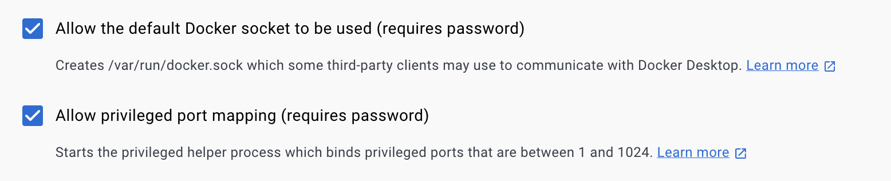

# Installation

In this section, we will explain how to install the NEBULA platform.

## Table of contents

-   [Prerequisites](#prerequisites)
-   [Obtaining NEBULA platform](#obtaining-nebula-platform)
-   [Installing NEBULA platform](#installing-nebula-platform)
-   [Checking the installation](#checking-the-installation)
-   [Building NEBULA core](#building-nebula-core)
-   [Running NEBULA](#running-nebula)
-   [NEBULA Frontend](#nebula-frontend)
-   [Stop NEBULA](#stop-nebula)
-   [Possible issues during the installation or execution](#possible-issues-during-the-installation-or-execution)

## Prerequisites

-   Python 3.10 or higher (3.11 recommended)
-   Docker Engine 24.0.4 or higher (24.0.7 recommended, https://docs.docker.com/engine/install/)
-   Docker Compose 2.19.0 or higher (2.19.1 recommended, https://docs.docker.com/compose/install/)
-   For using NVIDIA GPUs, NVIDIA driver version >=525.60.13 (Linux) >=528.33 (Windows), and CUDA 12.1 (mandatory). More information in https://docs.nvidia.com/cuda/cuda-installation-guide-microsoft-windows/index.html (Windows) or https://docs.nvidia.com/cuda/cuda-installation-guide-linux/index.html (Linux)

## Obtaining NEBULA platform

You can obtain the source code from https://github.com/CyberDataLab/nebula

Or, if you happen to have git configured, you can clone the repository:

    git clone https://github.com/CyberDataLab/nebula.git

Now, you can move to the source directory:

    cd nebula

### Installing NEBULA platform

To install the NEBULA platform, you can use the following command line:

    make install

This command will install the required dependencies for the platform and open a shell to start the platform.

If the shell is not opened or you want to reopen the shell, you can use the following command line:

    make shell

### Checking the installation

Once the installation is finished, you can check by listing the version
of the NEBULA with the following command line:

    python app/main.py --version

## Building NEBULA core

There are two ways to deploy the node in the federation: using Docker
containers or isolated processes. You can choose the one that best fits
your needs in the frontend.

### 1. Using Docker containers

You need to build the docker image using the following command line in
the root directory:

    docker build -t nebula-core .

In case of using GPU in the docker, you have to follow the instructions
in the following link to install nvidia-container-toolkit:

https://docs.nvidia.com/datacenter/cloud-native/container-toolkit/install-guide.html

You can check the docker images using the following command line:

    docker images

### 2. Using isolated processes

There is no need additional steps to build the core using isolated processes.

## Running NEBULA

To run NEBULA, you can use the following command line:

    python app/main.py [PARAMS]

The first time you run the platform, the nebula-frontend docker image
will be built. This process can take a few minutes.

You can show the PARAMS using:

    python app/main.py --help

The frontend will be available at http://127.0.0.1:6060 (by default)

To change the default port of the frontend, you can use the following
command line:

    python app/main.py --webport [PORT]

To change the default port of the statistics endpoint, you can use the
following command line:

    python app/main.py --statsport [PORT]

## NEBULA Frontend

You can login with the following credentials:

    - User: admin
    - Password: admin

If not working the default credentials, send an email to [Enrique Tomás
Martínez Beltrán](mailto:enriquetomas@um.es) to get the credentials.

## Stop NEBULA

To stop NEBULA, you can use the following command line:

    python app/main.py --stop

Be careful, this command will stop all the containers related to NEBULA:
frontend, controller, and nodes.

## Possible issues during the installation or execution

If frontend is not working, check the logs in app/logs/frontend.log

If any of the following errors appear, take a look at the docker logs of
the nebula-frontend container:

docker logs nebula-frontend

------------------------------------------------------------------------

Network nebula_X Error failed to create network nebula_X: Error response
from daemon: Pool overlaps with other one on this address space

Solution: Delete the docker network nebula_X

> docker network rm nebula_X

------------------------------------------------------------------------

Error: Cannot connect to the Docker daemon at
unix:///var/run/docker.sock. Is the docker daemon running?

Solution: Start the docker daemon

> sudo dockerd

Solution: Enable the following option in Docker Desktop

Settings -> Advanced -> Allow the default Docker socket to be used

> 

------------------------------------------------------------------------

Error: Cannot connect to the Docker daemon at tcp://X.X.X.X:2375. Is the
docker daemon running?

Solution: Start the docker daemon

> sudo dockerd -H tcp://X.X.X.X:2375

------------------------------------------------------------------------

If frontend is not working, restart docker daemon

> sudo systemctl restart docker

------------------------------------------------------------------------

Error: Too many open files

Solution: Increase the number of open files

> ulimit -n 65536

Also, you can add the following lines to the file
/etc/security/limits.conf

> -   soft nofile 65536
> -   hard nofile 65536
